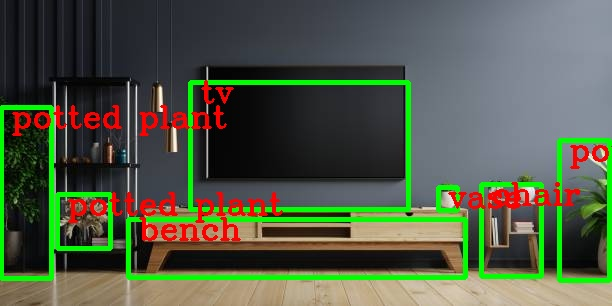

The code starts by loading an image from the specified path using the OpenCV library and checks if the image was successfully loaded. Next, it reads class names from a text file that contains the names of objects that can be recognized in the image. The code uses a pre-trained model to analyze the image and detect objects, drawing rectangles around the detected objects. Then, it displays the modified image with rectangles and labels for the detected objects. Finally, the modified image is saved, and all opened windows are closed.

